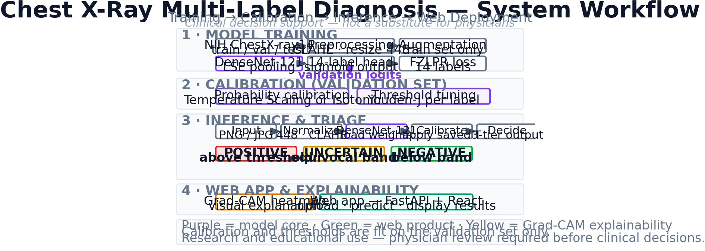

# Chest X-Ray Multi-Label Diagnosis (NIH ChestX-ray14)

End-to-end deep learning system for **multi-label chest X-ray screening** on the
[NIH ChestX-ray14](https://nihcc.app.box.com/v/ChestXray-NIHCC) dataset
(112,120 images, 14 pathology labels).

Graduation thesis project by **Nguyen Ba Nhat**. It covers model design, training,
probability calibration, explainability (Grad-CAM), evaluation, and a deployable
**FastAPI + React** web demo.

---

## Overview

Radiologists often need to check many findings on a single X-ray. This project
automates that workflow: upload one image, receive calibrated probabilities
for 14 common chest conditions, and inspect Grad-CAM heatmaps for model focus
areas.

| Stage | What happens |
|-------|----------------|
| **Preprocessing** | Resize, normalize, optional CLAHE and augmentation |
| **Classification** | DenseNet-121 + LSE pooling → 14 sigmoid outputs |
| **Calibration** | Per-label Temperature Scaling or Isotonic Regression |
| **Decision** | Per-label thresholds tuned on validation data |
| **Delivery** | REST API + React UI + Grad-CAM overlays |

---

## 14 Detected Findings

Atelectasis · Cardiomegaly · Consolidation · Edema · Effusion · Emphysema ·
Fibrosis · Hernia · Infiltration · Mass · Nodule · Pleural Thickening ·
Pneumonia · Pneumothorax

---

## Key Contributions

| Area | Detail |
|------|--------|
| **Spatial pooling** | LSE (Log-Sum-Exp) pooling as the proposed method vs. GAP baseline |
| **Loss function** | FZLPR for class-imbalanced multi-label learning (BCE/ASL ablations included) |
| **Calibration** | Post-hoc per-label calibration that picks TS or Isotonic by validation NLL |
| **Explainability** | Grad-CAM heatmaps aligned with model decision regions |
| **Evaluation** | Rigorous proposed-vs-reference comparison on official NIH splits |
| **Deployment** | Full-stack demo with inference API, file upload UI, and result visualization |

---

## Tech Stack

| Layer | Stack |
|-------|-------|
| Deep Learning | Python 3.10+, PyTorch, DenseNet-121, CUDA |
| Backend | FastAPI, Uvicorn |
| Frontend | React 18, Vite |
| ML utilities | scikit-learn (calibration), OpenCV, Albumentations |
| Explainability | Grad-CAM |
| Dataset | NIH ChestX-ray14 |

---

## System Pipeline

<p align="center">
  
</p>

Editable source: [`docs/workflow.drawio`](docs/workflow.drawio)  
Regenerate diagram: `python scripts/export_workflow_svg.py`

Four phases: **model training**, **calibration on validation**,
**inference and triage**, and **web deployment with Grad-CAM explainability**.

---

## Proposed vs. Reference Baseline

Fair comparison using the same backbone, loss, and data splits:

| Component | Proposed (`config.yaml`) | Reference (`config_tham_chieu.yaml`) |
|-----------|--------------------------|--------------------------------------|
| Pooling | **LSE** | GAP |
| Loss | FZLPR | FZLPR |
| View position (AP/PA) | Enabled | Disabled |
| Advanced augmentation | CLAHE, corner erase, and related transforms | Basic only |
| Calibration | Temperature Scaling + Isotonic | Temperature Scaling only |
| TTA at inference | Supported | Disabled |

Checkpoints (local, not in Git):

```text
models/nih_densenet121/v2/best_model.pth          # proposed
models/nih_densenet121/tham_chieu/best_model.pth  # reference
```

---

## Web Application

| Feature | Description |
|---------|-------------|
| Upload | Single X-ray image inference |
| Results | 14-label probability bars with threshold indicators |
| Grad-CAM | Visual overlay per selected finding |
| API | `/predict` endpoint for programmatic access |

```powershell
dev.bat
```

| Service | URL |
|---------|-----|
| Backend | http://localhost:8001 |
| Frontend | http://localhost:5173 |

---

## Project Structure

```text
configs/        YAML configs (proposed, reference, BCE/ASL ablations)
src/cnn/        Dataset, model, train, calibrate, inference, Grad-CAM
src/api/        FastAPI backend and services
frontend/       React/Vite single-page app
scripts/        Split prep, evaluation, Grad-CAM analysis
docs/           Workflow diagrams
models/         Checkpoint directory (not tracked)
```

---

## Getting Started

### 1. Environment

```powershell
python -m venv venv
venv\Scripts\activate
pip install -r requirements.txt
cd frontend && npm install && cd ..
```

### 2. Dataset and Checkpoints

- Download NIH ChestX-ray14 and create splits (`scripts/prepare_nih_splits.py`)
- Place trained weights under `models/` (see paths above)
- Update dataset paths in `configs/config.yaml` (default placeholder: `D:/archive`)

### 3. Train and Calibrate

```powershell
# Proposed model (LSE + FZLPR)
python -m src.cnn.train --config configs/config.yaml

# Reference baseline (GAP)
python -m src.cnn.train --config configs/config_tham_chieu.yaml

# Fit calibration and per-label thresholds → configs/calibration.json
python -m src.cnn.calibrate --config configs/config.yaml
```

### 4. Evaluate (optional)

```powershell
python scripts/evaluate_v2_test.py
python scripts/evaluate_de_xuat_vs_tham_chieu.py
python scripts/compare_gradcam_de_xuat_vs_tham_chieu.py
python scripts/plot_confusion_matrix_v2.py
python scripts/test_gradcam_14_labels.py
```

Requires a local dataset and checkpoints.

---

## Not Included in Git

| Excluded | Reason |
|----------|--------|
| NIH images and CSV splits | Size (~45 GB) |
| Model checkpoints (`.pth`) | Large binary files |
| `outputs_nih/` and similar | Generated at runtime |
| `frontend/node_modules/` | Install via npm |

---

## Author

**Nguyen Ba Nhat** — Graduation thesis on multi-label chest X-ray diagnosis  
GitHub: [Nhatnguyn1710/KLTN_ChestXray14](https://github.com/Nhatnguyn1710/KLTN_ChestXray14)

> For research and educational purposes. Not intended as a standalone clinical
> diagnostic device.
