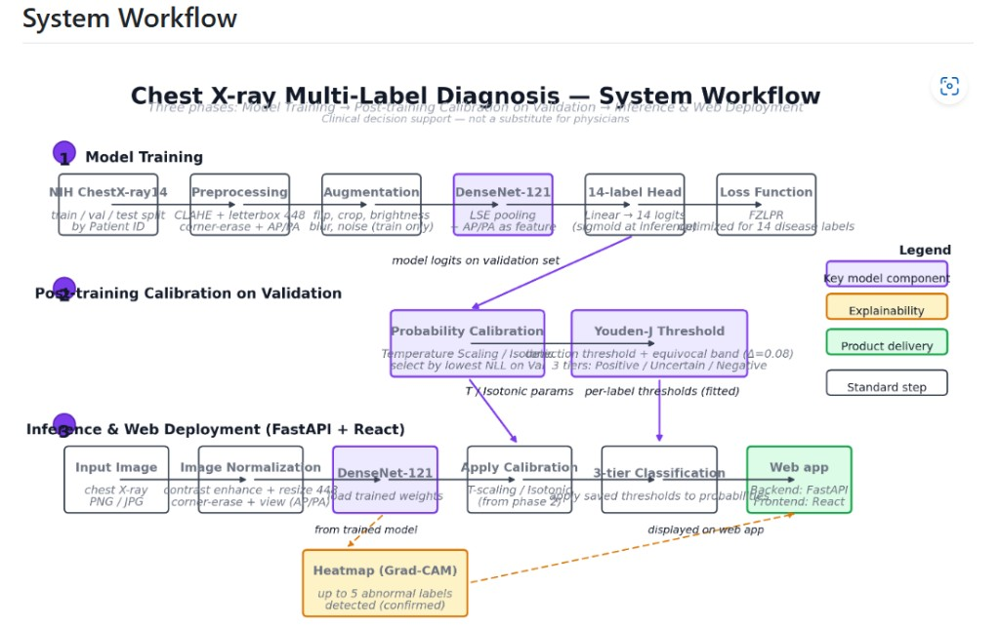

# KLTN ChestXray14 Diagnosis

Deep learning system for multi-label chest X-ray diagnosis on NIH ChestX-ray14.
The project includes DenseNet-121 training/evaluation, probability calibration,
Grad-CAM visualization, a FastAPI backend, and a React frontend.

## System Workflow

<p align="center">
  <a href="docs/system-workflow.png">
    
  </a>
</p>

Editable diagram source: [`docs/workflow.drawio`](docs/workflow.drawio) (open in [diagrams.net](https://app.diagrams.net/) for editing; GitHub preview of `.drawio` may render incorrectly).

## Main Features

- Multi-label classification for 14 NIH ChestX-ray14 findings.
- DenseNet-121 backbone with a custom multi-label classification head.
- Support for BCE, ASL, and FZLPR loss configurations.
- Probability calibration and per-label thresholds.
- Grad-CAM heatmap generation for visual explanation.
- Web application with FastAPI backend and React frontend.

## Repository Structure

```text
configs/        Training, inference, and calibration configuration files
frontend/       React/Vite frontend application
scripts/        Utility scripts for data split, evaluation, and analysis
src/api/        FastAPI backend
src/cnn/        Dataset, model, training, calibration, inference, Grad-CAM
models/         Placeholder for model checkpoints (not tracked by Git)
```

## Files Not Included in Git

The following files are intentionally not tracked because they are large or
generated locally:

- NIH ChestX-ray14 images and split CSV files.
- Model checkpoints, for example `models/nih_densenet121/v2/best_model.pth`.
- Training outputs such as `outputs_nih/`, `outputs_nih_bce/`,
  `outputs_nih_asl/`, and `outputs_nih_tham_chieu/`.
- Runtime uploads and generated Grad-CAM images.
- Frontend dependencies in `frontend/node_modules/`.

## Required Local Files

Before running inference, place the trained checkpoint at:

```text
models/nih_densenet121/v2/best_model.pth
```

The default dataset paths are configured in:

```text
configs/config.yaml
```

By default, the config expects NIH ChestX-ray14 data under:

```text
D:/archive
```

If the dataset is stored elsewhere, update the paths in `configs/config.yaml`
and the other config files as needed.

## Environment Setup

Create and activate a Python virtual environment:

```powershell
python -m venv venv
venv\Scripts\activate
pip install -r requirements.txt
```

Install frontend dependencies:

```powershell
cd frontend
npm install
cd ..
```

## Run the Web Application

For development, run both backend and frontend:

```powershell
dev.bat
```

Backend:

```text
http://localhost:8001
```

Frontend:

```text
http://localhost:5173
```

Alternatively, run the backend manually:

```powershell
venv\Scripts\activate
python -m src.api.app --config configs/config.yaml --port 8001
```

Then run the frontend:

```powershell
cd frontend
npm run dev
```

## Training

Train the main FZLPR configuration:

```powershell
python -m src.cnn.train --config configs/config.yaml
```

Train BCE:

```powershell
python -m src.cnn.train --config configs/config_bce.yaml
```

Train ASL:

```powershell
python -m src.cnn.train --config configs/config_asl.yaml
```

## Calibration

Run probability calibration and threshold selection:

```powershell
python -m src.cnn.calibrate --config configs/config.yaml
```

The main calibration file used by the web application is:

```text
configs/calibration.json
```

Additional calibration files are provided for the BCE and ASL ablation
configurations:

```text
configs/calibration_bce.json
configs/calibration_asl.json
```

## Evaluation Scripts

Scripts for reproducing the thesis experiments and figures (Chapter 3):

```powershell
# Data preparation
python scripts/prepare_nih_splits.py

# Test-set metrics (Table 3.4, Table 3.6, Figure 3.7 with --tta)
python scripts/evaluate_v2_test.py

# Proposed vs reference configuration (Table 3.5, Figure 3.4)
python scripts/evaluate_de_xuat_vs_tham_chieu.py

# Grad-CAM: proposed vs reference (Figure 3.5, Figure 3.6)
python scripts/compare_gradcam_de_xuat_vs_tham_chieu.py

# Confusion matrices per label (Figure 3.11)
python scripts/plot_confusion_matrix_v2.py

# Calibrated thresholds per label (Figure 3.12)
python scripts/plot_hinh_3_14_thresholds.py

# Grad-CAM heatmaps for 14 labels (Figure 3.13)
python scripts/test_gradcam_14_labels.py
```

Pipeline sanity checks (independent of the thesis figures):

```powershell
python scripts/smoke_train_step.py
python scripts/smoke_inference_parity.py
```

Some scripts require the NIH dataset and trained checkpoints to be available
locally.

## Notes

This repository contains source code and lightweight configuration files only.
Dataset files, model checkpoints, generated figures, slides, and runtime outputs
are excluded from Git. Store those artifacts separately and place them in the
expected paths before running full inference or evaluation.
