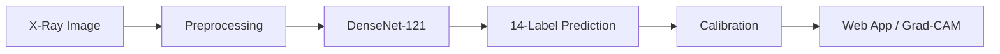

# Chest X-Ray Multi-Label Diagnosis (NIH ChestX-ray14)

AI system that detects **14 chest diseases** from a single X-ray image.
Built as a graduation thesis project with a full **train → calibrate → deploy** pipeline
and a production-style **web demo**.

**Dataset:** [NIH ChestX-ray14](https://nihcc.app.box.com/v/ChestXray-NIHCC)

---

## What This Project Does

| Step | Description |
|------|-------------|
| **Input** | Chest X-ray image (PA / AP view) |
| **Model** | DenseNet-121 deep learning classifier |
| **Output** | Probability score for each of 14 findings (e.g. Pneumonia, Effusion, Cardiomegaly) |
| **Explainability** | Grad-CAM heatmaps highlight regions the model focuses on |
| **Deployment** | FastAPI backend + React frontend for interactive inference |

---

## Highlights

- **Multi-label classification** — one image, up to 14 concurrent findings
- **LSE pooling** — proposed spatial aggregation vs. standard GAP baseline
- **FZLPR loss** — designed for imbalanced medical labels
- **Calibrated probabilities** — Temperature Scaling + Isotonic Regression per label
- **Baseline comparison** — proposed system vs. minimal reference config for fair evaluation
- **End-to-end codebase** — training, calibration, evaluation scripts, and web UI in one repo

---

## Tech Stack

| Layer | Technologies |
|-------|--------------|
| Deep Learning | PyTorch, DenseNet-121, CUDA |
| Backend | FastAPI, Python 3.10+ |
| Frontend | React, Vite |
| Explainability | Grad-CAM |
| Data | NIH ChestX-ray14 (112K+ images) |

---

## System Pipeline



---

## Proposed vs. Reference

| | Proposed | Reference baseline |
|---|----------|-------------------|
| Config | `configs/config.yaml` | `configs/config_tham_chieu.yaml` |
| Pooling | LSE | GAP |
| Augmentation | Advanced (CLAHE, etc.) | Basic |
| Calibration | Temperature + Isotonic | Temperature only |

---

## Project Structure

```
configs/     Model & training configurations
src/cnn/     Dataset, model, training, calibration, inference
src/api/     FastAPI REST API
frontend/    React web application
scripts/     Evaluation & analysis utilities
models/      Checkpoints (not included in Git)
```

---

## Quick Start

**1. Setup**

```powershell
python -m venv venv
venv\Scripts\activate
pip install -r requirements.txt
```

**2. Place checkpoint** (train locally or use your own weights)

```
models/nih_densenet121/v2/best_model.pth
```

**3. Update dataset path** in `configs/config.yaml` (default: `D:/archive`)

**4. Run web app**

```powershell
dev.bat
```

| Service | URL |
|---------|-----|
| API | http://localhost:8001 |
| UI | http://localhost:5173 |

---

## Training & Calibration

```powershell
# Train proposed model
python -m src.cnn.train --config configs/config.yaml

# Calibrate probabilities & set per-label thresholds
python -m src.cnn.calibrate --config configs/config.yaml
```

---

## Not Included in Git

- Dataset images and CSV splits
- Model checkpoints (`.pth`)
- Training outputs (`outputs_nih/`)
- `node_modules/`

Download data and weights separately, then update paths in `configs/*.yaml`.

---

## Author

Graduation thesis — **Multi-label chest X-ray diagnosis on NIH ChestX-ray14**  
Repository: [github.com/Nhatnguyn1710/KLTN_ChestXray14](https://github.com/Nhatnguyn1710/KLTN_ChestXray14)
